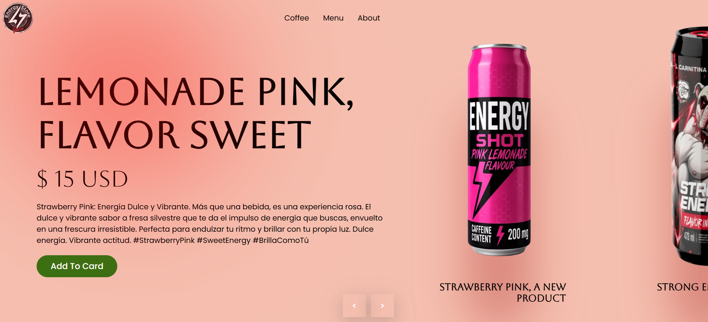

# Energy Store - Product Carousel

This project is a visually appealing, interactive product carousel for a fictional energy drink store. The main goal is to showcase products in a modern and dynamic way, creating an engaging user experience.

## Screenshot

## Development & Technology

This website was developed using pure front-end technologies, with no reliance on external frameworks or libraries.

*   **HTML5:** For the basic structure of the website.
*   **CSS3:** Used for all styling, layout, and animations.
    *   **Responsive Design:** The layout adapts to different screen sizes (desktop, tablet, and mobile) using Media Queries.
    *   **CSS Variables:** Used for easy theme management and consistency (e.g., colors, dimensions).
    *   **CSS Animations:** The carousel transitions and image effects are handled with native CSS `@keyframes` and `transitions` for optimal performance.
*   **JavaScript (ES6+):**
    *   **Dynamic Content:** The product information (titles, descriptions, images) is stored in a JavaScript array. The HTML content for each product slide is generated dynamically, making it easy to add, remove, or modify products without touching the HTML file.
    *   **Interactive Carousel:** All carousel logic, including navigation (next/previous buttons) and autoplay, is controlled by JavaScript.

## Design Intent

The design aims to be modern, immersive, and bold, reflecting the "energetic" nature of the products.

*   **Visual Focus:** The design places a strong emphasis on the product image, making it the central element of the composition.
*   **Dynamic Theming:** The background color of the page changes dynamically to match the color palette of the currently displayed product, creating a cohesive and immersive feel.
*   **Typography:** Google Fonts (`Aboreto` and `Poppins`) were chosen to provide a clean, modern aesthetic that is both stylish and highly readable.

## Author dev

JavGarin

