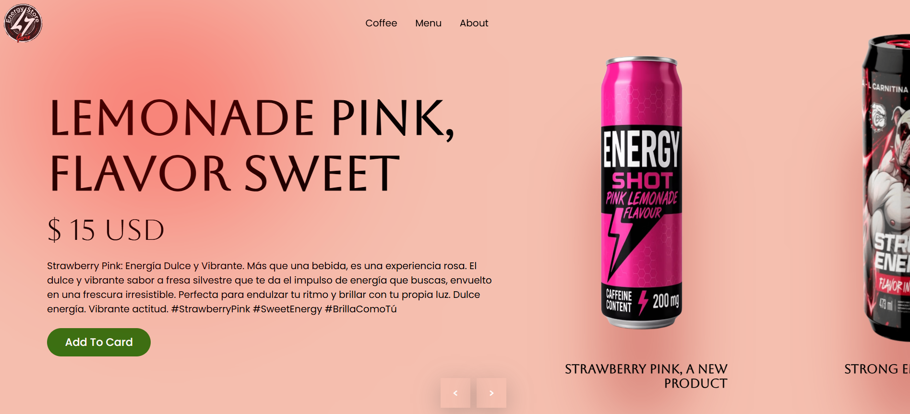
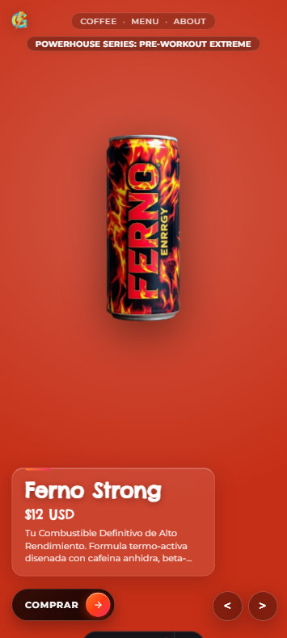

# Energy Store — Bebidas Energéticas & Coleccionables

> Carrusel cinematográfico de productos construido con **Astro** + **Vanilla CSS** · Diseño Awwwards 2026



---

## Descripción

**Energy Store** es un showcase de bebidas energéticas internacionales diseñado con una experiencia visual de alto impacto. El producto central es un carrusel de slides completamente custom, sin librerías externas, con animaciones cinematográficas basadas en `clip-path`, traslaciones y transiciones de color coordinadas.

El diseño sigue la estética **Awwwards 2026**: glassmorphism, interacciones magnéticas, paleta energética y tipografía premium.

---

## Vista previa

### Desktop


### Mobile
<p align="center">
  
</p>

---

## Stack técnico

| Tecnología | Uso |
|---|---|
| [Astro 5](https://astro.build) | Framework de renderizado y bundling |
| Vanilla CSS | Estilos, animaciones y sistema de diseño completo |
| JavaScript (ES Modules) | Motor del carrusel (`CarouselEngine`) |
| Google Fonts | `Chelsea Market` + `Montserrat` |
| Vercel | Deploy y hosting |

---

## Características principales

- **Carrusel cinematográfico** con `clip-path: circle()` animado desde el centro de cada producto
- **Logo de marca interactivo** — hover con aura eléctrica naranja y escala elástica (`cubic-bezier` spring)
- **Botón CTA 2026** — diseño Obsidiana Granate + Electric Orb naranja-rojo-magenta con Liquid Shimmer sweep y elevación en hover
- **Contenedor glassmorphism** para título y descripción del producto — `backdrop-filter: blur(18px)` + acento energético `::before`
- **Nav centrado** anclado al 50% del viewport con `position: absolute` + `translateX(-50%)`
- **Responsive completo** — Mobile First con layout vertical, latas flotantes y animaciones coordinadas
- **SEO/OpenGraph profesional** — `og:image` con URL absoluta, dimensiones, alt, `twitter:card`, canonical, theme-color
- **Loading screen** — spinner personalizado con animación de energía crema-rosada
- **Autoplay + swipe táctil + teclado** — navegación accesible multimodal

---

## Paleta de colores

| Token | Valor | Uso |
|---|---|---|
| Rojo energético | `#c62f17` | Fondo Ferno Strong, loader spinner |
| Naranja eléctrico | `#ff7e29` | Orb del botón CTA, acento del text-card |
| Magenta | `#f42e61` | Gradiente orb y acento decorativo |
| Rosa suave | `#f5bfaf` | Fondo Berry Pink |
| Marrón cálido | `#9c4d2f` | Fondo Juice Punch |
| Verde hulk | `#7eb63d` | Fondo Energy Hulk |

---

## Estructura del proyecto

```
energy-store-slides-css/
├── public/
│   ├── images/             # Imágenes de los productos (latas)
│   ├── logo_energystore.png
│   └── screenshot-energy-store.png
├── src/
│   ├── layouts/
│   │   └── Layout.astro    # HTML base, SEO/OG, loader, fuentes
│   ├── pages/
│   │   └── index.astro     # Estructura del hero + header con logo
│   ├── scripts/
│   │   └── carousel.js     # CarouselEngine — lógica y datos de productos
│   └── styles/
│       └── main.css        # Sistema de diseño completo
├── astro.config.mjs
└── package.json
```

## Autor

**Javier Garin** — [@JavGarin](https://github.com/JavGarin)

> Desarrollo frontend — Diseño web de alto impacto visual
